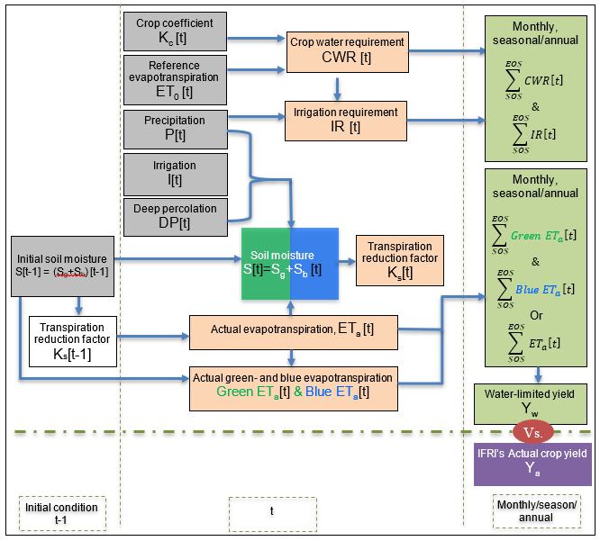

# CropGBWater
##  GLOBAL GRIDDED MODEL OF CROPS' GREEN and BLUE WATER USE AND WATER-LIMITED CROP YIELD  
### Version 2.1
**Project**: ***Foresight Initiative: Global Gridded Crop Water Demand 2020 (G2CWD)***

 **September 2023**

**Authors:** 
* Mesfin Mergia Mekonnen (University of Alabama, mesfin.mekonnen@ua.edu)
* Abebe D. Chukalla (IHE Delft, a.chukalla@un-ihe.org),

**Cite as:** 
 Mekonnen, M.M., Chukalla, A.D.GLOBAL GRIDDED MODEL FOR ASSESSING CROPS' GREEN AND BLUE WATER USE AND WATER-LIMITED CROP YIELD (v2.1). https://zenodo.org/records/10914453, October 2023

The Python script for the 2GBWater model processes diverse input data, including crop details, soil properties, and climate records. It calculates crucial parameters like crop water requirements, irrigation needs, and yields. The script tracks daily water dynamics and fluxes, distinguishing green and blue components, and saves results in CSV files for analysis across crops and locations. 
